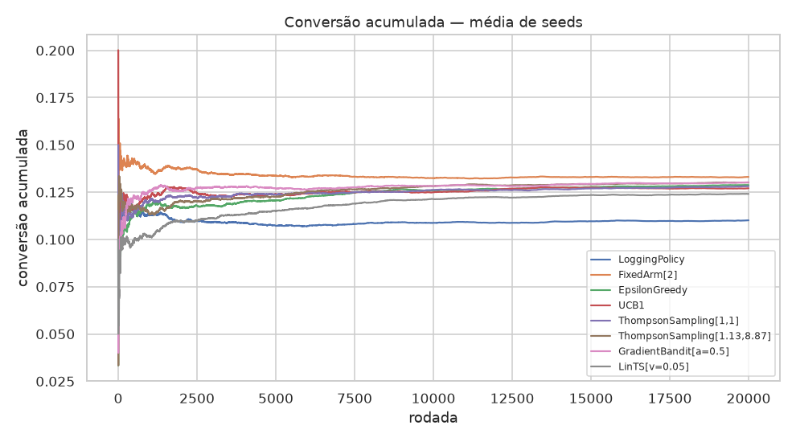
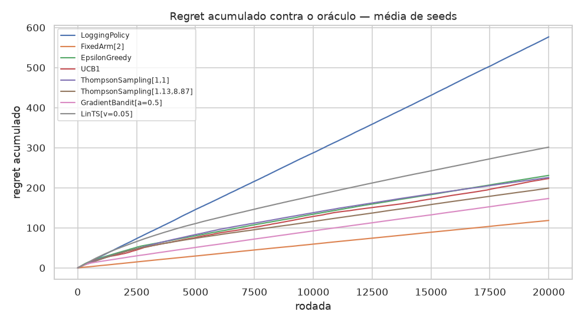
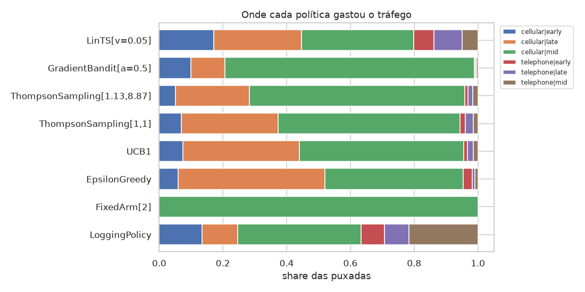

# Plataforma de Experimentação Adaptativa para Ofertas

**Tech Challenge Fase 5 / Datathon — POSTECH MLET**

> 🚧 **Em construção.** O projeto está na Fase 5 de 8 do plano de implementação.
> Etapas 1, 2, 3, 4 e 7 do enunciado entregues; faltam a API (Etapa 5), a arquitetura em nuvem
> (Etapa 6) e o vídeo (Etapa 8).
>
> **Entrando no projeto agora?** Comece por [`docs/BRIEFING.md`](docs/BRIEFING.md) — contexto,
> decisões tomadas com o racional, decisões em aberto e referências de estudo.
> Plano de execução em [`docs/PLANO.md`](docs/PLANO.md).

---

## O problema

Uma instituição financeira digital precisa decidir, em cada canal, **qual oferta, mensagem ou próximo
passo apresentar a cada cliente elegível**.

A abordagem tradicional tem dois modos, e os dois desperdiçam:

- **Regra fixa** — congela a decisão. Não reage a mudança de contexto e não personaliza.
- **Teste A/B longo** — divide o tráfego meio a meio por semanas e só decide no fim. Metade do
  tráfego vai para o braço pior durante todo o experimento.

A alternativa é uma abordagem **adaptativa (multi-armed bandit)**: realocar tráfego em tempo real
conforme a evidência chega, equilibrando **exploração** (testar o que ainda é incerto) e
**explotação** (usar o que já se sabe que funciona). Na variante **contextual**, o sistema vai além de
eleger um vencedor único — aprende que decisões diferentes servem perfis diferentes.

## A base

[**bank-marketing** (henriqueyamahata) no Kaggle](https://www.kaggle.com/datasets/henriqueyamahata/bank-marketing) —
equivalente ao `bank-additional-full.csv` do *UCI Bank Marketing Dataset*. Campanhas de telemarketing
de um banco português, com target binário `y` (assinou depósito a prazo).

| | |
|---|---|
| Arquivo | `bank-additional-full.csv` (separador `;`) |
| Dimensões | 41.188 linhas × 21 colunas |
| Target | `y` — 4.640 `yes` / 36.548 `no` → **conversão de 11,27%** |
| Origem | [UCI ML Repository, dataset 222](https://archive.ics.uci.edu/dataset/222/bank+marketing) |
| Licença | CC BY 4.0 |
| SHA-256 | `74adfc57…afb4d8` — conferido a cada download por `make data` |

O download é feito por [`scripts/download_data.sh`](scripts/download_data.sh), que tenta o Kaggle e cai
no UCI quando não há credencial. As duas vias passam pela mesma verificação de integridade.

As 21 colunas, pelo papel que cumprem na formulação:

| Papel | Colunas | Observações |
|---|---|---|
| **Contexto — cliente** | `age`, `job`, `marital`, `education`, `default`, `housing`, `loan`, `campaign`, `pdays`, `previous`, `poutcome` | O que a política vê para decidir |
| **Contexto — conjuntura** | `emp.var.rate`, `cons.price.idx`, `cons.conf.idx`, `euribor3m`, `nr.employed` | Constantes dentro de cada período — ver abaixo |
| **Ação** | `contact`, `month`, `day_of_week` | Decisões da campanha. É daqui que saem os braços |
| **Alvo** | `y` | Assinou depósito a prazo |
| **Proibida** | `duration` | Vazamento — ver abaixo |

Nenhum valor nulo em 41.188 linhas. Três tratamentos que a EDA fixou
([`notebooks/01_eda.ipynb`](notebooks/01_eda.ipynb)):

- **`unknown` é preservado como nível**, não imputado. Aparece em 6 colunas, de 20,9% em `default`
  a 0,2% em `marital`. No `bank-marketing` ele registra que a informação não foi obtida na
  ligação — é resposta, não ausência. Imputar inventaria dado.
- **`pdays == 999` é sentinela**, não distância: marca "nunca contatado antes" e vale para 96,3%
  das linhas. Vira a flag `first_contact`, porque tratá-lo como número faz o modelo ler 999 dias
  como "contato muito antigo". A separação é grande: 9,26% de conversão entre os nunca
  contatados contra 63,83% entre os que já tinham histórico.
- **Os cinco indicadores macro são carimbo de calendário.** O R² de cada um contra o índice de
  período é **1,0000** (0,9996 para `euribor3m`) — são literalmente constantes dentro do período,
  e para `cons.price.idx` cada valor identifica um único período. Indicador constante no período
  não personaliza: move a taxa-base, não distingue cliente. Por isso vivem em `MACRO_COLUMNS`,
  separados de `CLIENT_COLUMNS`, e o ambiente da Fase 2 os trata como ablação em vez de contexto
  padrão.

**`duration` é descartada.** A coluna registra a duração da ligação, que só é conhecida *depois* do
desfecho — vazamento temporal explícito. O enunciado a cita nominalmente, e a EDA mostra o tamanho
do problema: um modelo treinado **só com `duration`** alcança **AUC 0,819**, acima das 19 features
legítimas juntas (**0,816**); com ela no conjunto completo, a AUC sobe para **0,955**. Ligação que
termina em venda dura mais — no momento de decidir a quem ligar, esse número ainda não existe.


## A formulação: o que é um "braço" aqui

O ponto de partida é uma observação sobre o dataset: nem toda coluna descreve o cliente. Algumas
registram **decisões que a campanha tomou**.

| Contexto (quem é o cliente) | Ação (o que o banco escolheu) |
|---|---|
| `age`, `job`, `marital`, `education`, `housing`, `loan`, `campaign`, `pdays`, `previous`, `poutcome`, indicadores socioeconômicos | `contact` (celular / telefone fixo), `month`, `day_of_week` |

Os braços saem das colunas de ação. Isso tem uma consequência decisiva: **todo braço aparece no log
histórico**, então `P(conversão | contexto, braço)` é estimável a partir de dado observado para
qualquer braço — sem sintetizar recompensa, sem inventar taxa de conversão.

O enunciado pede decidir "qual oferta, mensagem **ou próximo passo**" — canal e momento de abordagem
são exatamente isso.

### Os seis braços

O espaço foi fixado **pelo suporte observado, não por conveniência**. O critério foi registrado
antes de rodar a análise: o pior braço precisa de **≥ 1.000 eventos e ≥ 100 conversões**. Mil
eventos dão erro-padrão de ~1 p.p. sobre uma taxa de 11%; cem conversões é o piso para a taxa não
oscilar com um punhado de casos.

`day_of_week` entra agregado em três janelas — `early` (seg), `mid` (ter–qui), `late` (sex) —
porque a conversão por dia mostra exatamente essa estrutura: segunda é distintamente pior (9,95%),
ter/qua/qui formam um bloco apertado (11,67%–12,12%) e sexta fica no meio (10,81%).
`month` fica **fora** do braço: cruzá-lo daria 100 células e ele é o principal confundidor
temporal.

| Braço | Eventos | Conversões | Conversão | IC 95% (Wilson) |
|---|---:|---:|---:|---|
| `cellular \| mid` | 15.964 | 2.469 | **15,47%** | [14,91%; 16,04%] |
| `cellular \| late` | 4.645 | 676 | 14,55% | [13,57%; 15,60%] |
| `cellular \| early` | 5.535 | 708 | 12,79% | [11,94%; 13,70%] |
| `telephone \| mid` | 8.883 | 478 | 5,38% | [4,93%; 5,87%] |
| `telephone \| late` | 3.182 | 170 | 5,34% | [4,61%; 6,18%] |
| `telephone \| early` | 2.979 | 139 | 4,67% | [3,97%; 5,48%] |


Os três espaços candidatos (`contact` · `contact × week_window` · `contact × day_of_week`) passaram
no piso, então o desempate veio depois: separar `mid` em terça, quarta e quinta cria braços cujos
intervalos se sobrepõem quase inteiramente — granularidade que o bandit não consegue diferenciar —
e derruba o aproveitamento do replay de 16,7% para 10%, já que o track C só aceita o evento quando
o braço escolhido coincide com o registrado.

## Avaliação em duas camadas

```
log real → braços de ação
              ├── A: P(y|x,a) calibrado → ambiente → regret contra oráculo    [principal]
              └── C: rejection sampling sobre o log → CVR observada           [validação]
```

**A — ambiente calibrado.** Um modelo de propensão calibrado estima a recompensa esperada de cada
braço para cada cliente. Isso permite rodar milhares de decisões e medir **regret verdadeiro** contra
o melhor braço possível.

**C — replay.** Rejection sampling ([Li et al., WSDM 2011](https://arxiv.org/abs/1003.5956)) sobre o log
real: o evento só conta quando o braço escolhido coincide com o que foi de fato registrado, e a
recompensa é o `y` observado, nunca estimado. Serve de contraprova para o track A.

## Políticas comparadas

Todas implementam a mesma interface — `select(contexto) → braço` e `update(contexto, braço,
recompensa)` — para que trocar uma pela outra no experimento seja trocar uma linha, e a comparação
seja justa.

| Política | Papel |
|---|---|
| `LoggingPolicy` | **Baseline principal** — reamostra a mistura histórica de braços |
| `FixedArm` | Comparador duro — sempre `cellular \| mid`, o melhor braço do log |
| `EpsilonGreedy` | Exploração aleatória a taxa fixa |
| `UCB1` | Exploração guiada por incerteza |
| `ThompsonSampling` | Exploração bayesiana, Beta-Bernoulli com **priors documentados** |
| `LinTS` | **Contextual** — a única que lê o cliente |

A escolha do baseline não é detalhe. O braço mais usado do log (`cellular | mid`, 38,8% do volume)
é **também** o de maior conversão — modal e melhor histórico são o mesmo braço. Se o baseline fosse
"melhor braço histórico", qualquer bandit não-contextual convergiria exatamente para ele e o ganho
seria zero, falhando o requisito da Etapa 3.

Por isso o baseline principal é a **política de log**: a operação não jogava o melhor braço, jogava
uma mistura, e a conversão que ela realizou foi 11,27%. O melhor braço histórico fica como
comparador duro, e é contra ele que a política contextual precisa provar valor.

> **Duas fontes de número, não confundir.** As taxas desta seção (11,27% global, 15,47% em
> `cellular | mid`) são **observadas no log inteiro**. As da seção de resultados vêm do **ambiente
> calibrado sobre o conjunto de teste**, onde a política de log rende 11,01%. A diferença é de
> amostra e de método, não de contradição — cada tabela diz qual das duas está usando.

## O ambiente calibrado

O track A estima `P(y | contexto, braço)` com `HistGradientBoostingClassifier` calibrado por
isotônica. Um modelo único com o braço como feature, não um por braço: o menor braço tem ~111
conversões no treino, pouco para calibrar isoladamente.

O contexto são **12 colunas de cliente** — sem `duration`, sem as colunas de ação e sem os
indicadores macro, que a Fase 1 mostrou serem carimbo de calendário.

Nada disso vale sem prova, então o ambiente passa por **três portões antes de ser usado**. Se
qualquer um falhar, `build_environment` levanta exceção em vez de seguir.

**1. Calibração — global e por braço.** Calibração boa no total pode esconder um braço de baixo
volume completamente errado, e o experimento herdaria esse erro como se fosse verdade.

| Braço | n | Brier | Previsto | Observado | Desvio |
|---|---:|---:|---:|---:|---:|
| **TOTAL** | 8.238 | **0,0860** | 11,30% | 11,28% | **0,02 p.p.** |
| `cellular\|early` | 1.107 | 0,0986 | 12,44% | 12,83% | 0,39 p.p. |
| `cellular\|late` | 929 | 0,1071 | 14,89% | 14,53% | 0,36 p.p. |
| `cellular\|mid` | 3.193 | 0,1126 | 15,19% | 15,47% | 0,29 p.p. |
| `telephone\|early` | 596 | 0,0464 | 5,53% | 4,70% | 0,83 p.p. |
| `telephone\|late` | 636 | 0,0456 | 6,31% | 5,35% | **0,96 p.p.** |
| `telephone\|mid` | 1.777 | 0,0472 | 5,44% | 5,40% | 0,04 p.p. |

**2. Sanity check.** AUC **0,7413** contra **0,7274** de uma regressão logística. O ganho do
boosting é pequeno mas real; se fosse negativo, a complexidade extra seria ruído.

**3. Sobreposição (positividade).** Um modelo `P(braço | contexto)` mede se todo braço tem suporte
em toda a região do contexto. Onde não tem, prever é **extrapolar**:

| Braço | Propensão mín. | p01 | Mediana | Clientes abaixo de 1% |
|---|---:|---:|---:|---:|
| `cellular\|mid` | 0,1075 | 0,2064 | 0,3806 | 0,00% |
| `cellular\|early` | 0,0572 | 0,0739 | 0,1299 | 0,00% |
| `cellular\|late` | 0,0109 | 0,0331 | 0,1050 | 0,00% |
| `telephone\|mid` | 0,0056 | 0,0175 | 0,2278 | 0,11% |
| `telephone\|early` | 0,0012 | 0,0066 | 0,0729 | **3,76%** |
| `telephone\|late` | 0,0000 | 0,0048 | 0,0755 | **4,37%** |

Para ~96% dos clientes o ambiente interpola entre linhas que existem. Para os ~4% restantes, os
braços de telefone fixo são extrapolação — consequência direta do confounding temporal, já que o
fixo praticamente sumiu da campanha depois de agosto de 2008.

### O teto do ganho contextual

Com o ambiente calibrado dá para responder, **antes de escrever qualquer política**, se
personalizar tem como valer a pena. Basta comparar o melhor braço fixo com um oráculo que escolhe
o braço ideal cliente a cliente:

| | CVR |
|---|---:|
| Melhor braço fixo (`cellular\|mid`) | 13,37% |
| Oráculo contextual | 13,97% |
| **Ganho máximo teórico** | **+0,59 p.p. (+4,44%)** |
| Clientes cujo braço ótimo difere do global | 47,43% |

Quase metade dos clientes tem outro braço ótimo, mas o ganho total é de meio ponto percentual — as
trocas são quase todas entre braços de probabilidade praticamente igual. **Esse número define o
que a política contextual pode disputar**, e volta na leitura dos resultados.

## Resultados

**20.000 rodadas × 10 seeds**, média com intervalo de confiança de 95% (t de Student entre seeds).
Baseline = política de log.

| Política | CVR | IC 95% | Uplift vs baseline | Exploração |
|---|---:|---|---:|---:|
| `FixedArm[cellular\|mid]` | **13,31%** | [13,14%; 13,47%] | **+20,85%** | 0,0% |
| `ThompsonSampling[1.13, 8.87]` | **13,01%** | [12,84%; 13,18%] | **+18,16%** | 23,0% |
| `EpsilonGreedy[ε=0.05]` | 12,88% | [12,55%; 13,20%] | +16,95% | 16,1% |
| `ThompsonSampling[1, 1]` | 12,81% | [12,56%; 13,06%] | +16,36% | 38,0% |
| `UCB1[c=0.25]` | 12,70% | [12,50%; 12,91%] | +15,38% | 41,7% |
| `LinTS[v=0.05]` | 12,41% | [12,24%; 12,58%] | +12,69% | 59,5% |
| `LoggingPolicy` (baseline) | 11,01% | [10,83%; 11,19%] | — | 61,3% |




**Todas as políticas adaptativas superam o baseline**, com folga e sem sobreposição de intervalos.
A melhor delas entrega **+18,2%** de conversão sobre a política que a operação de fato executava.

Três leituras que os números impõem:

**O prior informado vence o uniforme.** `Beta(1.13, 8.87)` codifica a taxa-base de 11,27% com a
força de 10 observações, e rende 13,01% contra 12,81% do `Beta(1, 1)`. O motivo aparece na coluna
de exploração: 23,0% contra 38,0%. Partir de uma crença calibrada poupa exatamente as rodadas que
o prior uniforme gasta descobrindo que nenhum braço converte a 50%.

**O braço fixo ganha de todas as adaptativas — e isso era esperado.** O ambiente é estacionário e
tem um braço dominante, então a melhor jogada possível é justamente cravar nele. As adaptativas
pagam exploração para **descobrir** esse braço; a `FixedArm` já começa sabendo. Mas ela só sabe
porque a Fase 1 analisou o log inteiro antes. Numa campanha nova, com braço novo ou com
comportamento mudando no tempo, essa informação não existe — e é aí que o bandit paga a si mesmo.
A `FixedArm` é o **limite superior de um oráculo estacionário**, não uma alternativa disponível
no dia zero.

**A política contextual não se paga.** A `LinTS` fica em 12,41%, abaixo da Thompson não-contextual,
com 59,5% de exploração ainda no fim do horizonte. A explicação está no teto medido acima: há
apenas **+4,44%** de ganho contextual disponível, e capturá-lo exige estimar 41 features × 6 braços
= **246 parâmetros** a partir de recompensa binária que sai 1 em cada 9 vezes. O custo de
exploração é maior que o prêmio.

Isso não é bug de implementação: o teste
[`test_lints_beats_context_free_thompson_when_context_matters`](tests/test_policies.py) roda a
mesma `LinTS` num ambiente onde o braço ótimo depende do cliente, e lá ela **supera** a Thompson
comum. A máquina detecta heterogeneidade quando ela existe. **Nestes dados, o efeito do braço é
quase todo não-contextual** — canal importa muito, perfil quase nada.

### Análise de exploração × conversão

Cada política foi calibrada por sweep sobre o ambiente (5 seeds, 20.000 rodadas):

| `UCB1` `c` | CVR | Exploração | | `ε-Greedy` `ε` | CVR | | `LinTS` `v` | CVR |
|---:|---:|---:|---|---:|---:|---|---:|---:|
| 0,05 | 11,00% | 18,4% | | 0,02 | 12,85% | | 0,02 | 12,38% |
| 0,10 | 12,42% | 10,8% | | **0,05** | **12,89%** | | **0,05** | **12,44%** |
| **0,25** | **12,74%** | 43,0% | | 0,10 | 12,58% | | 0,10 | 12,22% |
| 0,50 | 12,18% | 51,6% | | 0,20 | 12,41% | | 0,25 | 12,03% |
| 1,00 | 11,58% | 68,2% | | | | | 0,50 | 11,62% |

O `UCB1` mostra a curva em U mais nítida: **o `c = 1.0` do livro-texto é o pior valor**, com 68%
de exploração. O bônus `√(2·ln t / n)` foi desenhado para recompensa em toda a faixa [0, 1], mas
aqui as médias vivem entre 5% e 15% — o bônus domina o sinal e a política nunca se decide. Com
`c = 0.05` acontece o oposto: explora de menos, trava cedo e fica em 11,00%.



## O replay: a contraprova sem modelo no meio

Tudo acima veio do ambiente calibrado, que é um **modelo**. A crítica óbvia — "vocês testaram a
política contra a própria estimativa de vocês" — é justa, e o track C existe para respondê-la com
evidência em vez de argumento.

O método é rejection sampling
([Li, Chu, Langford & Wang, WSDM 2011](https://arxiv.org/abs/1003.5956)): percorre o log real, e só
conta o evento quando a política escolhe exatamente o braço que foi de fato jogado. Aí a recompensa
é o `y` observado — **nunca estimado**. Como não há modelo no caminho, os dois tracks erram por
motivos diferentes; concordância entre eles é evidência de verdade.

| Política | CVR replay | CVR com IPS | IC 95% (IPS) | Aceitação | n aceito | n efetivo |
|---|---:|---:|---|---:|---:|---:|
| `FixedArm[cellular\|mid]` | 15,47% | **14,00%** | [14,00%; 14,00%] | 38,8% | 3.193 | 3.000 |
| `EpsilonGreedy` | 15,25% | **13,50%** | [13,31%; 13,70%] | 33,3% | 2.741 | 2.127 |
| `ThompsonSampling[1, 1]` | 13,99% | 12,55% | [11,85%; 13,25%] | 20,3% | 1.671 | 984 |
| `ThompsonSampling[1.13, 8.87]` | 14,43% | 12,37% | [11,95%; 12,80%] | 24,0% | 1.978 | 1.242 |
| `UCB1` | 13,88% | 12,07% | [11,55%; 12,58%] | 17,3% | 1.424 | 903 |
| `LoggingPolicy` | 12,28% | 11,48% | [10,70%; 12,25%] | 24,1% | 1.983 | 1.022 |
| `LinTS` | 12,25% | 11,27% | [10,26%; 12,28%] | 18,4% | 1.511 | 787 |

A coluna **IPS** corrige o viés da política de log por ponderação de propensão inversa: o banco não
escolheu braço ao acaso, então o replay puro herda as preferências dele. O estimador é
auto-normalizado (Hájek), e os pesos têm piso — sem ele, uma linha com propensão de 1e-6 decidiria
a estimativa sozinha.

**Aceitação e n efetivo são o custo do método.** Com 6 braços, uma política concentrada aceita ~39%
do log e uma exploratória ~17%. A `LinTS` fica com 787 eventos efetivos de 8.238 — daí seus
intervalos serem os mais largos da tabela.

### Os dois tracks concordam

| Política | Ambiente | Replay (IPS) | Rank A | Rank C | Δ |
|---|---:|---:|:-:|:-:|:-:|
| `FixedArm[cellular\|mid]` | 13,31% | 14,00% | 1 | 1 | 0 |
| `ThompsonSampling[1.13, 8.87]` | 13,01% | 12,37% | 2 | 4 | **+2** |
| `EpsilonGreedy` | 12,88% | 13,50% | 3 | 2 | −1 |
| `ThompsonSampling[1, 1]` | 12,81% | 12,55% | 4 | 3 | −1 |
| `UCB1` | 12,70% | 12,07% | 5 | 5 | 0 |
| `LinTS` | 12,41% | 11,27% | 6 | **7** | +1 |
| `LoggingPolicy` | 11,01% | 11,48% | 7 | 6 | −1 |

**Spearman = 0,857.** Os dois métodos ordenam as políticas quase igual, apesar de um simular 20.000
decisões contra um modelo e o outro peneirar um log real de 8.238 linhas. O ambiente calibrado não
está inventando um ranking.

### A triangulação que fecha o argumento

O caso mais instrutivo é a `FixedArm`, porque três estimativas independentes convergem:

```
replay cru (só os eventos cellular|mid do log)  →  15,47%
replay corrigido por propensão inversa          →  14,00%
ambiente calibrado                              →  13,31%
```

O replay cru é **otimista**, e o motivo é seleção: os clientes que de fato receberam `cellular|mid`
não eram um recorte aleatório — a operação escolhia quem ligar. A ponderação IPS corrige boa parte
desse viés e move a estimativa **três quartos do caminho** até o número do ambiente, que corrige o
resto por modelagem.

Dois métodos que não compartilham nenhuma premissa chegando ao mesmo lugar é a evidência mais forte
deste README.

### Onde os tracks discordam — e o que isso muda

**A vantagem do prior informado não se replica.** No ambiente ele é 2º; no replay, 4º. O ganho de
+0,20 p.p. sobre o prior uniforme não sobrevive quando medido só com recompensa observada. A
conclusão honesta é que **o prior informado acelera a convergência** — a diferença de exploração,
23,0% contra 38,0%, é real e reproduz nos dois tracks — mas o efeito sobre a conversão final está
dentro do ruído.

**A `LinTS` cai para último, abaixo do baseline.** No ambiente ela superava a `LoggingPolicy`
(12,41% contra 11,01%); no replay ela fica atrás (11,27% contra 11,48%). Os intervalos se sobrepõem,
então "pior que o baseline" não é afirmável — mas *"melhor que o baseline"* também deixa de ser.

Essa é a segunda evidência independente, por um caminho que não passa por modelo nenhum, de que a
política contextual não entrega nestes dados. Ver a seção de resultados para o porquê.

### Rastreio no MLflow

Cada política vira um **run pai** com média e intervalo entre seeds, e um **run filho por seed** —
77 runs no total. A média fica citável e cada seed permanece auditável.

```bash
make mlflow   # http://localhost:5000
```

Params registrados: política, hiperparâmetros, `n_rounds`, `n_seeds`, `n_arms`, `seed`.
Métricas: `cvr_final`, `cvr_ci_low/high`, `regret_final`, `regret_ci_low/high`,
`uplift_vs_baseline`, `exploration_rate`.

## Golden Set

Cinco clientes do conjunto de teste, **escolhidos por critério, não sorteados** — cinco clientes
médios receberiam a mesma resposta e a tabela não provaria nada. Cada um exercita uma parte
diferente da superfície de decisão.

Reprodutível por [`src/golden_set.py`](src/golden_set.py); `make train` grava
`models/golden_set.csv`.

**Probabilidade estimada de conversão, por braço (%):**

| Critério | Perfil | `cel\|early` | `cel\|late` | `cel\|mid` | `tel\|early` | `tel\|late` | `tel\|mid` | Recomendado |
|---|---|---:|---:|---:|---:|---:|---:|---|
| Sem histórico | 32a, empresário | 8,98 | 8,83 | **10,82** | 4,05 | 5,72 | 4,87 | `cellular\|mid` |
| Converteu antes | 23a, admin., `poutcome=success` | 51,43 | **71,11** | **71,11** | **71,11** | **71,11** | **71,11** | *empate* |
| Muitos contatos | 49a, técnico, `campaign=6` | **7,51** | 7,36 | 6,44 | **7,50** | 5,39 | 4,05 | *empate no topo* |
| Perfil mediano | 31a, doméstica | 10,89 | 9,66 | **11,29** | 4,33 | 5,71 | 6,17 | `cellular\|mid` |
| **Troca de braço** | 18a, estudante | 45,44 | **50,87** | 44,85 | 22,00 | 33,48 | 12,82 | `cellular\|late` |

### A decisão fez sentido? Caso a caso

**1. Sem histórico** — recomenda `cellular|mid`, o mesmo braço que vence na média, com 1,84 p.p.
sobre o segundo. Nunca participou de campanha anterior, então não há histórico para elevar a
estimativa e ela fica perto da taxa-base. Decisão correta e sem graça, que é o esperado.

**2. Converteu antes** — cinco dos seis braços empatam em 71,11%. Não é coincidência: a calibração
isotônica é uma **função em degraus**, e clientes de alta propensão caem todos no mesmo patamar.
Chamar o argmax disso de preferência seria ler ruído. A resposta honesta é *"para este cliente
tanto faz — escolha pelo custo do canal"*. É também um artefato de modelagem que vale conhecer.

**3. Muitos contatos** — o caso mais interessante depois do quinto. Os dois primeiros braços estão
empatados (0,01 p.p. entre eles), **mas os dois superam `cellular|mid` em 1,07 p.p.** A recomendação
útil aqui é por exclusão: *sair* do braço que é melhor na média. Entre os líderes, decide o custo.
Note que `telephone|early` aparece no topo — para um cliente já cansado de 6 ligações no celular, o
canal alternativo deixa de ser inferior.

**4. Perfil mediano** — `cellular|mid` com margem de 0,39 p.p., dentro do erro de calibração. Mais
um empate na prática.

**5. Troca de braço** — o caso que a personalização existe para capturar. Estudante de 18 anos:
`cellular|late` a 50,87% contra 44,85% de `cellular|mid`. **A troca vale 6,01 p.p.**, e a diferença
entre o melhor e o pior braço para este cliente é de **38 p.p.** Aqui a decisão importa muito.

### O que o Golden Set demonstra

**Três dos cinco casos são empates.** Isso não é falha da seleção — é exatamente como um teto
contextual de +4,44% se manifesta cliente a cliente. Na maioria dos perfis os braços do topo são
indistinguíveis; numa minoria, como o estudante, a escolha vale dezenas de pontos percentuais.

O conjunto é consistente com o resto do projeto: **personalizar aqui rende pouco na média e muito em
poucos casos** — e um bandit contextual não consegue identificar quais são esses casos rápido o
bastante para pagar a exploração.

> ⚠️ **De onde vem este ranking.** As probabilidades por braço vêm do **modelo de recompensa
> calibrado** (o *Direct Method*), não de uma política de bandit. As políticas deste projeto são
> não-contextuais: elas dariam a **mesma** resposta aos cinco clientes. A distinção importa e volta
> na seção da API — o *scorer* ordena, o bandit decide quando explorar em vez de cravar no topo.

## Como executar

```bash
make setup   # cria o .venv e instala as dependências
make data    # baixa a base do Kaggle para data/raw/
make train   # roda o experimento ponta a ponta e serializa os artefatos
make api     # sobe a API em http://localhost:8000/docs   (Fase 6)
make mlflow  # abre a UI do MLflow em http://localhost:5000
make test    # roda a suíte de testes — 162 no total
make lint    # checa estilo e erros estáticos com ruff
```

`make train` leva ~3 minutos: prepara a base, calibra o ambiente e roda as 7 políticas em 20.000
rodadas × 10 seeds. Aceita `--rounds`, `--seeds` e `--no-mlflow` para execuções rápidas:

```bash
.venv/bin/python train.py --rounds 2000 --seeds 3 --no-mlflow
```

Ele grava `models/environment.joblib` (ambiente serializado, com encoder e modelo),
`models/results.csv`, `models/metadata.json` e as figuras desta página.

A análise exploratória está em [`notebooks/01_eda.ipynb`](notebooks/01_eda.ipynb) e é versionada
sem saídas. Para executá-la, `.venv/bin/jupyter lab notebooks/01_eda.ipynb` — ela regenera as
figuras de [`reports/figures/`](reports/figures).

`make data` **não exige credencial**: se houver token do Kaggle em `~/.kaggle/kaggle.json` ele é usado,
senão o download vem do UCI. Nos dois casos o arquivo é conferido por SHA-256, e o comando é
idempotente — rodar de novo com o arquivo íntegro não baixa nada.

Via Docker:

```bash
make docker-up
```

<!-- Fase 6: confirmar que o docker compose sobe API + MLflow -->

## Arquitetura-alvo em nuvem

<!-- Fase 7: 1 a 2 parágrafos (Etapa 6) -->
_A preencher._

## Governança

<!-- Fase 7: base legal, finalidade, minimização, retenção, humano no loop -->
_A preencher._

## A limitação principal: quanto do efeito de canal é calendário?

Esta é a ressalva mais séria do projeto, e ela tem número. Vale ler antes de citar qualquer uplift.

**O problema.** A campanha não usou os dois canais ao mesmo tempo. O primeiro quarto do log é
**100% telefone fixo**, e a partir do segundo o celular passa de 90% do volume. No mesmo intervalo
a taxa-base de conversão sobe de 3,5% para 47%, empurrada por conjuntura e por mudança de
segmentação. Como o período **não está no contexto** — tiramos os indicadores macro justamente por
serem carimbo de calendário — o ambiente atribui ao canal aquilo que era da época.

**A medida.** Restringir a análise à janela onde os dois canais rodaram lado a lado remove o
calendário da comparação. O que sobra:

| Braço | Base completa | Só na coexistência | Diferença |
|---|---:|---:|---:|
| `cellular\|mid` | 15,47% | 15,47% | — |
| `cellular\|late` | 14,55% | 14,55% | — |
| `cellular\|early` | 12,79% | 12,79% | — |
| `telephone\|mid` | 5,38% | **12,94%** | +7,56 p.p. |
| `telephone\|late` | 5,34% | **12,55%** | +7,21 p.p. |
| `telephone\|early` | 4,67% | **10,43%** | +5,76 p.p. |

Os braços de celular não se movem — ele só existiu na janela tardia. Os de telefone fixo **mais que
dobram**.

```
vantagem do celular sobre o fixo, base completa  →  +181,7%
vantagem do celular sobre o fixo, na coexistência →   +19,3%
                                                      ───────
                              inflação do número  →     9,4x
```

**O que isso faz com o resultado principal.** O uplift de +18,2% da melhor adaptativa sobre o
baseline vem em boa parte de o baseline carregar o primeiro quarto da campanha, quando todas as
ligações eram no fixo e a conversão era 3,5%. O bandit "ganha" evitando os braços de fixo — que
eram ruins sobretudo pela **época** em que foram usados.

A decisão que a política toma continua correta: dado o log, `cellular|mid` **é** o melhor braço, e o
baseline de fato jogava 36% de telefone fixo e de fato converteu 11,27%. O que fica em dúvida é a
**magnitude**: o ganho medido pressupõe que o efeito de canal seja causal. Sob a leitura
conservadora — só o que sobrevive dentro da janela de coexistência — ele fica mais perto de
**+8% a +9%** do que dos +18,2%.

**Por que não corrigimos restringindo a base.** Testamos. Na janela de coexistência a campanha já
usava celular em 90% das ligações, então o baseline já estava quase ótimo e **nenhuma política
adaptativa o supera** (baseline 14,54%, melhor adaptativa 14,50%). Restringir tornaria a análise
causalmente mais limpa e o resultado inteiramente nulo — a operação já tinha aprendido a lição que o
bandit teria ensinado.

**E o bandit resgataria uma regra congelada?** Também testamos, e **não**. Uma regra fixa escolhida
antes de o celular existir fica presa em `telephone|late`; quando o celular aparece, o custo de não
migrar é de apenas **+2,8%** — porque dentro daquela janela os canais são próximos. Este dataset
não oferece o contraexemplo de "a regra fixa quebra quando o mundo muda". Reprodutível em
[`src/scenarios.py`](src/scenarios.py).

## Limitações

Registradas desde já, porque condicionam a leitura de qualquer resultado:

- **Viés do log histórico.** O ambiente do track A é calibrado sobre decisões que o banco tomou por
  critério operacional, não aleatoriamente. Ele herda esse viés.
- **Confounding temporal em `contact` — quantificado, e é grande.** Ver a seção dedicada abaixo.
- **Os cinco indicadores macro são proxies de calendário**, com R² de 1,0000 contra o índice de
  período. Ficam fora do contexto padrão do ambiente justamente por isso; mantidos como ablação.
- **A heterogeneidade braço × contexto é fraca.** Nas estratificações testadas (`job`,
  `education`, `marital`, `poutcome`), quando o melhor braço muda de identidade os intervalos de
  Wilson dos concorrentes se sobrepõem. O ambiente calibrado quantificou o efeito: teto de apenas
  **+4,44%** para qualquer política contextual, e a `LinTS` não o captura.
- **Extrapolação nos braços de telefone fixo.** Para 3,76% e 4,37% dos clientes, `telephone|early` e
  `telephone|late` têm propensão abaixo de 1% — nessas regiões o ambiente prediz onde o log
  praticamente não observou.
- **Hiperparâmetros calibrados no mesmo ambiente em que são reportados.** O sweep de `ε`, `c` e `v`
  usou o ambiente de teste, o que favorece as políticas adaptativas frente ao baseline e à
  `FixedArm`, que não têm o que calibrar. A tabela completa do sweep está publicada acima
  justamente para que o efeito seja visível em vez de embutido.
- **A garantia de não-viés do replay não se aplica integralmente**, porque a política que gerou o log
  não era aleatória uniforme entre os braços. É o que a ponderação IPS atenua — sem eliminar, já que
  o modelo de propensão também é uma estimativa.
- **O replay tem pouca amostra efetiva.** Com 6 braços ele descarta de 61% a 83% do log conforme a
  política, e a `LinTS` fica com 787 eventos efetivos de 8.238. Diferenças pequenas entre políticas
  não são detectáveis nesse track.
- **Ambiente calibrado não é tráfego real.** Nenhum resultado offline substitui um teste em produção.

## Estrutura do repositório

```
├── train.py              # experimento ponta a ponta
├── src/
│   ├── config.py         # paths, schema, espaço de braços, hiperparâmetros, seed
│   ├── data.py           # carga e pipeline de preparação determinístico
│   ├── eda.py            # agregações, intervalos de Wilson e figuras da análise
│   ├── arms.py           # espaço de braços, mistura histórica, melhor braço
│   ├── environment.py    # P(y | contexto, braço) calibrado + portões de qualidade
│   ├── policies.py       # baseline, ε-greedy, UCB1, Thompson, LinTS
│   ├── evaluation.py     # protocolo de ambiente, runner multi-seed, métricas, MLflow
│   ├── replay.py         # rejection sampling, IPS e comparação entre os dois tracks
│   ├── scenarios.py      # análise de sensibilidade temporal e confounding de canal
│   └── golden_set.py     # os cinco casos da Etapa 4
├── api/                  # serviço FastAPI                              (Fase 6)
├── notebooks/01_eda.ipynb
├── reports/figures/      # figuras do notebook e do experimento
├── scripts/download_data.sh
├── tests/
├── docs/PLANO.md         # plano de implementação em 8 fases
├── CLAUDE.md             # regras e decisões do projeto
└── CHANGELOG.md          # histórico de modificações
```

---

Base: [Kaggle — bank-marketing](https://www.kaggle.com/datasets/henriqueyamahata/bank-marketing) ·
Enunciado: `POSTECH - MLET - DATATHON (1).pdf`
