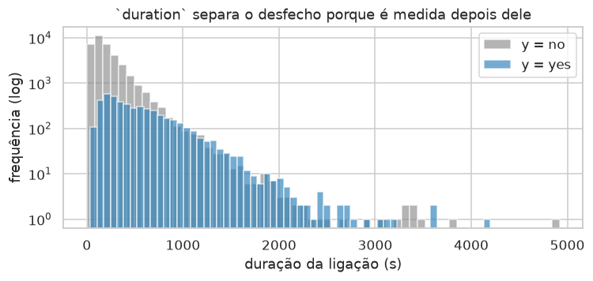
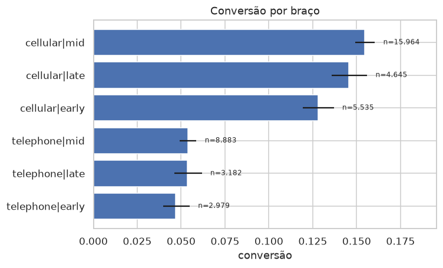

# Plataforma de Experimentação Adaptativa para Ofertas

**Tech Challenge Fase 5 / Datathon — POSTECH MLET**

> 🚧 **Em construção.** O projeto está na Fase 1 de 8 do plano de implementação.
> As seções de resultados, Golden Set e arquitetura em nuvem serão preenchidas conforme as fases avançam.
>
> **Entrando no projeto agora?** Comece por [`docs/BRIEFING.md`](docs/BRIEFING.md) — contexto,
> decisões tomadas com o racional, decisões em aberto e referências de estudo.
> Plano de execução em [`docs/PLANO.md`](docs/PLANO.md).

---

## O problema

Uma instituição financeira digital precisa decidir, em cada canal, **qual oferta, mensagem ou próximo
passo apresentar a cada cliente elegível**.

A abordagem tradicional tem dois modos, e os dois desperdiçam:

- **Regra fixa** — congela a decisão. Não reage a mudança de contexto e não personaliza.
- **Teste A/B longo** — divide o tráfego meio a meio por semanas e só decide no fim. Metade do
  tráfego vai para o braço pior durante todo o experimento.

A alternativa é uma abordagem **adaptativa (multi-armed bandit)**: realocar tráfego em tempo real
conforme a evidência chega, equilibrando **exploração** (testar o que ainda é incerto) e
**explotação** (usar o que já se sabe que funciona). Na variante **contextual**, o sistema vai além de
eleger um vencedor único — aprende que decisões diferentes servem perfis diferentes.

## A base

[**bank-marketing** (henriqueyamahata) no Kaggle](https://www.kaggle.com/datasets/henriqueyamahata/bank-marketing) —
equivalente ao `bank-additional-full.csv` do *UCI Bank Marketing Dataset*. Campanhas de telemarketing
de um banco português, com target binário `y` (assinou depósito a prazo).

| | |
|---|---|
| Arquivo | `bank-additional-full.csv` (separador `;`) |
| Dimensões | 41.188 linhas × 21 colunas |
| Target | `y` — 4.640 `yes` / 36.548 `no` → **conversão de 11,27%** |
| Origem | [UCI ML Repository, dataset 222](https://archive.ics.uci.edu/dataset/222/bank+marketing) |
| Licença | CC BY 4.0 |
| SHA-256 | `74adfc57…afb4d8` — conferido a cada download por `make data` |

O download é feito por [`scripts/download_data.sh`](scripts/download_data.sh), que tenta o Kaggle e cai
no UCI quando não há credencial. As duas vias passam pela mesma verificação de integridade.

As 21 colunas, pelo papel que cumprem na formulação:

| Papel | Colunas | Observações |
|---|---|---|
| **Contexto — cliente** | `age`, `job`, `marital`, `education`, `default`, `housing`, `loan`, `campaign`, `pdays`, `previous`, `poutcome` | O que a política vê para decidir |
| **Contexto — conjuntura** | `emp.var.rate`, `cons.price.idx`, `cons.conf.idx`, `euribor3m`, `nr.employed` | Constantes dentro de cada período — ver abaixo |
| **Ação** | `contact`, `month`, `day_of_week` | Decisões da campanha. É daqui que saem os braços |
| **Alvo** | `y` | Assinou depósito a prazo |
| **Proibida** | `duration` | Vazamento — ver abaixo |

Nenhum valor nulo em 41.188 linhas. Três tratamentos que a EDA fixou
([`notebooks/01_eda.ipynb`](notebooks/01_eda.ipynb)):

- **`unknown` é preservado como nível**, não imputado. Aparece em 6 colunas, de 20,9% em `default`
  a 0,2% em `marital`. No `bank-marketing` ele registra que a informação não foi obtida na
  ligação — é resposta, não ausência. Imputar inventaria dado.
- **`pdays == 999` é sentinela**, não distância: marca "nunca contatado antes" e vale para 96,3%
  das linhas. Vira a flag `first_contact`, porque tratá-lo como número faz o modelo ler 999 dias
  como "contato muito antigo". A separação é grande: 9,26% de conversão entre os nunca
  contatados contra 63,83% entre os que já tinham histórico.
- **Os cinco indicadores macro são carimbo de calendário.** O R² de cada um contra o índice de
  período é **1,0000** (0,9996 para `euribor3m`) — são literalmente constantes dentro do período,
  e para `cons.price.idx` cada valor identifica um único período. Indicador constante no período
  não personaliza: move a taxa-base, não distingue cliente. Por isso vivem em `MACRO_COLUMNS`,
  separados de `CLIENT_COLUMNS`, e o ambiente da Fase 2 os trata como ablação em vez de contexto
  padrão.

**`duration` é descartada.** A coluna registra a duração da ligação, que só é conhecida *depois* do
desfecho — vazamento temporal explícito. O enunciado a cita nominalmente, e a EDA mostra o tamanho
do problema: um modelo treinado **só com `duration`** alcança **AUC 0,819**, acima das 19 features
legítimas juntas (**0,816**); com ela no conjunto completo, a AUC sobe para **0,955**. Ligação que
termina em venda dura mais — no momento de decidir a quem ligar, esse número ainda não existe.



## A formulação: o que é um "braço" aqui

O ponto de partida é uma observação sobre o dataset: nem toda coluna descreve o cliente. Algumas
registram **decisões que a campanha tomou**.

| Contexto (quem é o cliente) | Ação (o que o banco escolheu) |
|---|---|
| `age`, `job`, `marital`, `education`, `housing`, `loan`, `campaign`, `pdays`, `previous`, `poutcome`, indicadores socioeconômicos | `contact` (celular / telefone fixo), `month`, `day_of_week` |

Os braços saem das colunas de ação. Isso tem uma consequência decisiva: **todo braço aparece no log
histórico**, então `P(conversão | contexto, braço)` é estimável a partir de dado observado para
qualquer braço — sem sintetizar recompensa, sem inventar taxa de conversão.

O enunciado pede decidir "qual oferta, mensagem **ou próximo passo**" — canal e momento de abordagem
são exatamente isso.

### Os seis braços

O espaço foi fixado **pelo suporte observado, não por conveniência**. O critério foi registrado
antes de rodar a análise: o pior braço precisa de **≥ 1.000 eventos e ≥ 100 conversões**. Mil
eventos dão erro-padrão de ~1 p.p. sobre uma taxa de 11%; cem conversões é o piso para a taxa não
oscilar com um punhado de casos.

`day_of_week` entra agregado em três janelas — `early` (seg), `mid` (ter–qui), `late` (sex) —
porque a conversão por dia mostra exatamente essa estrutura: segunda é distintamente pior (9,95%),
ter/qua/qui formam um bloco apertado (11,67%–12,12%) e sexta fica no meio (10,81%).
`month` fica **fora** do braço: cruzá-lo daria 100 células e ele é o principal confundidor
temporal.

| Braço | Eventos | Conversões | Conversão | IC 95% (Wilson) |
|---|---:|---:|---:|---|
| `cellular \| mid` | 15.964 | 2.469 | **15,47%** | [14,91%; 16,04%] |
| `cellular \| late` | 4.645 | 676 | 14,55% | [13,57%; 15,60%] |
| `cellular \| early` | 5.535 | 708 | 12,79% | [11,94%; 13,70%] |
| `telephone \| mid` | 8.883 | 478 | 5,38% | [4,93%; 5,87%] |
| `telephone \| late` | 3.182 | 170 | 5,34% | [4,61%; 6,18%] |
| `telephone \| early` | 2.979 | 139 | 4,67% | [3,97%; 5,48%] |



Os três espaços candidatos (`contact` · `contact × week_window` · `contact × day_of_week`) passaram
no piso, então o desempate veio depois: separar `mid` em terça, quarta e quinta cria braços cujos
intervalos se sobrepõem quase inteiramente — granularidade que o bandit não consegue diferenciar —
e derruba o aproveitamento do replay de 16,7% para 10%, já que o track C só aceita o evento quando
o braço escolhido coincide com o registrado.

## Avaliação em duas camadas

```
log real → braços de ação
              ├── A: P(y|x,a) calibrado → ambiente → regret contra oráculo    [principal]
              └── C: rejection sampling sobre o log → CVR observada           [validação]
```

**A — ambiente calibrado.** Um modelo de propensão calibrado estima a recompensa esperada de cada
braço para cada cliente. Isso permite rodar milhares de decisões e medir **regret verdadeiro** contra
o melhor braço possível.

**C — replay.** Rejection sampling ([Li et al., WSDM 2011](https://arxiv.org/abs/1003.5956)) sobre o log
real: o evento só conta quando o braço escolhido coincide com o que foi de fato registrado, e a
recompensa é o `y` observado, nunca estimado. Serve de contraprova para o track A.

## Políticas comparadas

| Política | Papel |
|---|---|
| Regra fixa | **Baseline principal** — a política de log, conversão realizada de 11,27% |
| Melhor braço histórico | Comparador secundário: `cellular \| mid`, 15,47% |
| ε-Greedy | Exploração aleatória com taxa fixa |
| UCB1 | Exploração guiada por incerteza |
| Thompson Sampling | Exploração bayesiana, Beta-Bernoulli com priors documentados |
| LinTS | **Contextual** — é onde a personalização aparece |

A escolha do baseline não é detalhe. O braço mais usado do log (`cellular | mid`, 38,8% do volume)
é **também** o de maior conversão — modal e melhor histórico são o mesmo braço. Se o baseline fosse
"melhor braço histórico", qualquer bandit não-contextual convergiria exatamente para ele e o ganho
seria zero, falhando o requisito da Etapa 3.

Por isso o baseline principal é a **política de log**: a operação não jogava o melhor braço, jogava
uma mistura, e a conversão que ela realizou foi 11,27%. Concentrar em `cellular | mid` rende 15,47%
— uplift de **+37%**, e legítimo. O melhor braço histórico fica como comparador duro, e é contra
ele que a política contextual precisa provar valor.

## Resultados

<!-- Fase 3/4/5: tabela comparativa, curvas de regret, resultado do replay -->
_A preencher._

## Golden Set

<!-- Fase 5: 5 clientes, braço recomendado, p̂ por braço e justificativa de negócio -->
_A preencher._

## Como executar

```bash
make setup   # cria o .venv e instala as dependências
make data    # baixa a base do Kaggle para data/raw/
make train   # roda o pipeline e serializa os artefatos
make api     # sobe a API em http://localhost:8000/docs
make mlflow  # abre a UI do MLflow em http://localhost:5000
make test    # roda a suíte de testes
make lint    # checa estilo e erros estáticos com ruff
```

A análise exploratória está em [`notebooks/01_eda.ipynb`](notebooks/01_eda.ipynb) e é versionada
sem saídas. Para executá-la, `.venv/bin/jupyter lab notebooks/01_eda.ipynb` — ela regenera as
figuras de [`reports/figures/`](reports/figures).

`make data` **não exige credencial**: se houver token do Kaggle em `~/.kaggle/kaggle.json` ele é usado,
senão o download vem do UCI. Nos dois casos o arquivo é conferido por SHA-256, e o comando é
idempotente — rodar de novo com o arquivo íntegro não baixa nada.

Via Docker:

```bash
make docker-up
```

<!-- Fase 6: confirmar que o docker compose sobe API + MLflow -->

## Arquitetura-alvo em nuvem

<!-- Fase 7: 1 a 2 parágrafos (Etapa 6) -->
_A preencher._

## Governança

<!-- Fase 7: base legal, finalidade, minimização, retenção, humano no loop -->
_A preencher._

## Limitações

Registradas desde já, porque condicionam a leitura de qualquer resultado:

- **Viés do log histórico.** O ambiente do track A é calibrado sobre decisões que o banco tomou por
  critério operacional, não aleatoriamente. Ele herda esse viés.
- **Confounding temporal em `contact`.** Os dois primeiros períodos da campanha (mai/jun de 2008)
  são **100% telefone fixo**; a partir de agosto o celular passa de 97%. Parte da vantagem medida
  do celular é a época em que ele foi usado, não o canal. Separar as duas coisas exigiria ter
  contatado o mesmo perfil pelos dois canais no mesmo período, e a operação não fez isso.
- **Os cinco indicadores macro são proxies de calendário**, com R² de 1,0000 contra o índice de
  período. Ficam fora do contexto padrão do ambiente justamente por isso; mantidos como ablação.
- **A heterogeneidade braço × contexto é fraca.** Nas estratificações testadas (`job`,
  `education`, `marital`, `poutcome`), quando o melhor braço muda de identidade os intervalos de
  Wilson dos concorrentes se sobrepõem — nenhuma troca é estatisticamente distinguível. É o
  principal risco aberto para a política contextual.
- **A garantia de não-viés do replay não se aplica integralmente**, porque a política que gerou o log
  não era aleatória uniforme entre os braços.
- **Ambiente calibrado não é tráfego real.** Nenhum resultado offline substitui um teste em produção.

## Estrutura do repositório

```
├── train.py              # pipeline ponta a ponta
├── src/                  # biblioteca: dados, braços, ambiente, políticas, replay, avaliação
│   ├── config.py         # paths, schema, espaço de braços, pisos de suporte, seed
│   ├── data.py           # carga e pipeline de preparação determinístico
│   └── eda.py            # agregações, intervalos de Wilson e figuras da análise
├── api/                  # serviço FastAPI
├── notebooks/01_eda.ipynb
├── reports/figures/      # figuras geradas pelo notebook
├── scripts/download_data.sh
├── tests/
├── docs/PLANO.md         # plano de implementação em 8 fases
├── CLAUDE.md             # regras e decisões do projeto
└── CHANGELOG.md          # histórico de modificações
```

---

Base: [Kaggle — bank-marketing](https://www.kaggle.com/datasets/henriqueyamahata/bank-marketing) ·
Enunciado: `POSTECH - MLET - DATATHON (1).pdf`
